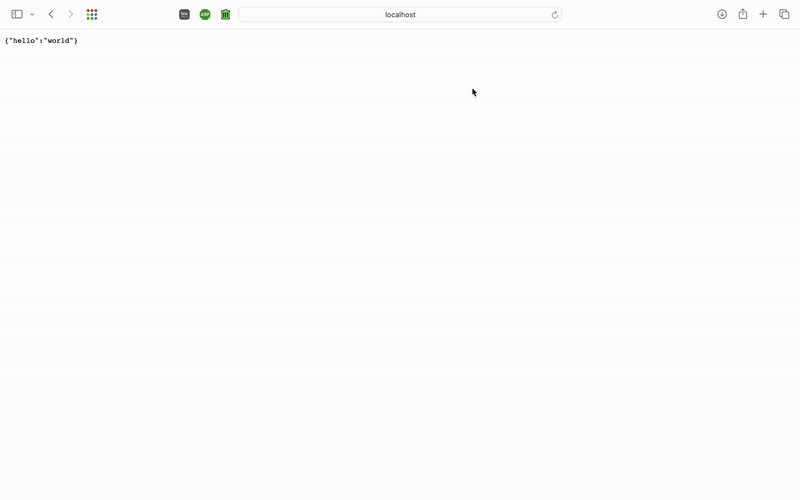

# Flask On Docker

## Overview 

This repo follows this tutorial: https://testdriven.io/blog/dockerizing-flask-with-postgres-gunicorn-and-nginx/

This repo is a Flask application with Postgres for development. I created a production-ready Docker Compose file that adds Gunicorn and Nginx into the mix to handle static and media files. You can now test out a production setup locally, where you can upload and view images.



## Build Instructions

### Development
Uses the default Flask development server.

1. Rename *.env.dev-sample* to *.env.dev*.
1. Update the environment variables in the *docker-compose.yml* and *.env.dev* files.
    - (M1 chip only) Remove `-slim-buster` from the Python dependency in `services/web/Dockerfile` to suppress an issue with installing psycopg2
1. Build the images and run the containers:

    ```sh
    $ docker-compose up -d --build
    ```

    Test it out at [http://localhost:8080](http://localhost:8080). The "web" folder is mounted into the container and your code changes apply automatically.

### Production

Uses gunicorn + nginx.

1. Rename *.env.prod-sample* to *.env.prod* and *.env.prod.db-sample* to *.env.prod.db*. Update the environment variables.
1. Build the images and run the containers:

    ```sh
    $ docker-compose -f docker-compose.prod.yml up -d --build
    ```

    Test it out at [http://localhost:8080](http://localhost:8080). No mounted folders. To apply changes, the image must be re-built.
